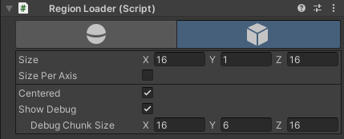

# Chunk Utilities

Helpful functions and utilities for managing chunk structures.

- Conversion functions

  - `WorldToChunk`
  - `WorldToVoxel`
  - `Flatten` (Flattens a `Vector3` into a `Vector3Int`)

- Region utilities
  - Spherical loading
  - Cubic loading
  - Support for variable sizes per chunk axis

https://user-images.githubusercontent.com/28305689/169299637-9c3bfe61-487d-4b5f-a1d1-8fb87564f5aa.mp4
